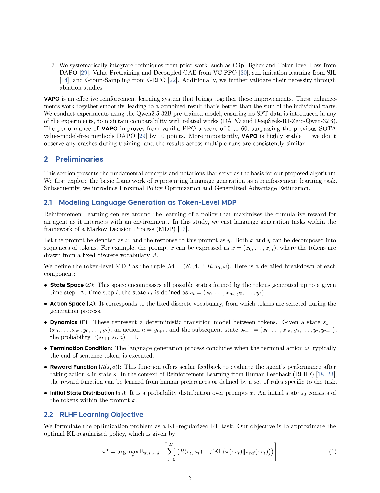
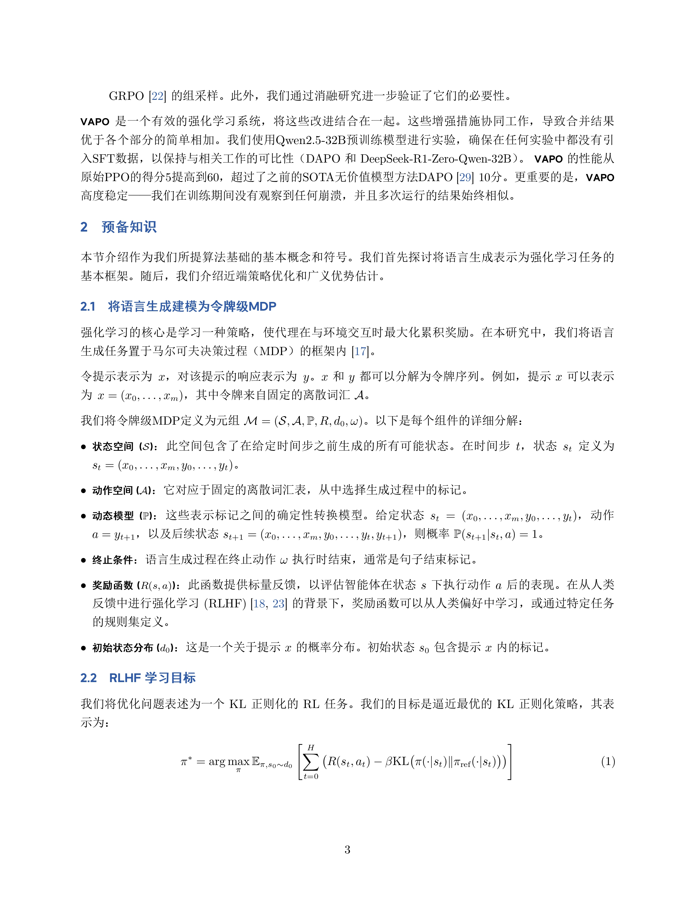

<div align="center">

[English](README.md) | [中文](README_CH.md) | 日本語

</div>

# 🚀 LaTeXTrans

> **マルチエージェント協調に基づく構造化LaTeX文書翻訳システム**

---

## ✨ 機能特徴

- 🧠 **マルチエージェント協調**：Parser、Translator、Summarizer、Terminology Extractor、Generator    
- 📄 **LaTeX構造保持**：`\section`、`\label`、`\ref`、数式環境とフォーマットを完全保持  
- 🌐 **柔軟なバックエンドサポート**：GPT-4、DeepSeekまたはカスタムLLM APIをサポート  
- 📚 **ArXiv IDサポート**：単一コマンドでarXiv論文を自動ダウンロードして翻訳  
- 🧰 **カスタマイズ可能なワークフロー**：要約生成、用語注入、翻訳エージェントを自由に調整  
- 🌏 **多言語翻訳**：現在🇨🇳中国語と🇯🇵日本語をサポート；🇰🇷韓国語は近日公開！

---

## 🛠️ インストールガイド

### 方法1：ローカルインストール

#### 1. リポジトリのクローン

```bash
git clone https://github.com/PolarisZZM/LaTeXTrans.git
cd LaTeXTrans
pip install -r requirements.txt
```

#### 2. TeXLiveのインストール

LaTeXファイルのコンパイル（PDF出力など）が必要な場合は、[TeXLive](https://www.tug.org/texlive/)をインストールしてください。

### 方法2：Dockerデプロイ（推奨）

Dockerを使用することで複雑な環境構成を回避できます。2つのバージョンのDockerイメージを提供しています：

#### 🐳 Dockerバージョン説明

| バージョン | イメージサイズ | 適用シーン |
|------|----------|----------|
| **基本版 (basic)** | ~800MB | 大部分の標準LaTeX文書に適しており、中国語サポートを含む |
| **完全版 (full)** | ~5GB | 複雑な文書に適しており、すべてのTeXLiveパッケージを含む |

#### Dockerイメージのビルド

```bash
# 基本版のビルド（推奨）
docker build -f Dockerfile.basic -t ymdxe/latextrans:v1.0.0-basic .

# 完全版のビルド（完全なTeXLiveサポートが必要な場合）
docker build -t ymdxe/latextrans:v1.0.0 .
```

#### Dockerコンテナの実行

**Windows PowerShellの例：**

```powershell
# arXiv論文の翻訳（論文IDを使用）
docker run `
  -e LLM_API_KEY="your-api-key" `
  -e LLM_BASE_URL="your-base-url" `
  -e LLM_MODEL="deepseek-v3" `
  -v "${PWD}\outputs:/app/outputs" `
  ymdxe/latextrans:v1.0.0 2505.15838

# ローカルTeXソースファイルの使用
docker run `
  -e LLM_API_KEY="your-api-key" `
  -e LLM_BASE_URL="your-base-url" `
  -e LLM_MODEL="deepseek-v3" `
  -v "${PWD}\outputs:/app/outputs" `
  -v "${PWD}\tex source:/app/tex source" `
  ymdxe/latextrans:v1.0.0 --source_dir "/app/tex source/2505.15838"
```

**Linux/Mac Bashの例：**

```bash
# arXiv論文の翻訳（論文IDを使用）
docker run \
  -e LLM_API_KEY="your-api-key" \
  -e LLM_BASE_URL="your-base-url" \
  -e LLM_MODEL="deepseek-v3" \
  -v "${PWD}/outputs:/app/outputs" \
  ymdxe/latextrans:v1.0.0 2505.15838

# ローカルTeXソースファイルの使用
docker run \
  -e LLM_API_KEY="your-api-key" \
  -e LLM_BASE_URL="your-base-url" \
  -e LLM_MODEL="deepseek-v3" \
  -v "${PWD}/outputs:/app/outputs" \
  -v "${PWD}/tex source:/app/tex source" \
  ymdxe/latextrans:v1.0.0 --source_dir "/app/tex source/2505.15838"
```

#### ビルドスクリプトの使用（Windows PowerShell）

```powershell
# 基本版のビルド
.\build-docker.ps1 -Version basic

# 完全版のビルド
.\build-docker.ps1 -Version full

# すべてのバージョンのビルド
.\build-docker.ps1 -Version all
```

### pipによるインストール（推奨）

当パッケージはpipで簡単にインストールできるようになっており、面倒なコード管理が不要です。

```pip
pip intsall latextrans

# GUI起動
latextrans -g
```

詳細な使用パラメータについては、後述の「CLIでの実行方法」で説明しているパラメータを参照してください。
---

## ⚙️ 設定説明

### ローカル設定

使用前に設定ファイルを編集してください：

```arduino
config/default.toml
```

言語モデルのAPIキーとベースURLを設定：

```toml
[llm]
api_key = " " #your_api_key_here
base_url = " " #base url of the API
model = "deepseek-v3" #モデル名（オプション）
```

### Docker環境変数設定

Dockerを使用する際は、環境変数で設定ファイルの設定を上書きできます：

- `LLM_API_KEY`: APIキー
- `LLM_BASE_URL`: APIベースURL
- `LLM_MODEL`: モデル名（例：deepseek-v3）

OpenAI、DeepSeek、Claudeまたは自己ホスト型LLMなどのサービスをサポートしています。

---

## 🚀 使用方法

### 🔹 ArXiv IDによる翻訳（推奨）

arXiv論文IDを提供するだけで翻訳を完了できます：

```bash
python main.py <paper_id> (例：2501.12948)
```

このコマンドは以下を実行します：

1. arXivからLaTeXソースコードをダウンロード
2. texソースファイルディレクトリに解凍
3. マルチエージェント翻訳ワークフローを実行
4. outputsフォルダに翻訳後の.texファイルとコンパイル済みPDFを保存

### 🔹 Dockerでの実行

**Windows PowerShellの例：**

```powershell
# 基本版Docker
docker run `
  -e LLM_API_KEY="your-api-key" `
  -e LLM_BASE_URL="your-base-url" `
  -e LLM_MODEL="deepseek-v3" `
  -v "${PWD}\outputs:/app/outputs" `
  ymdxe/latextrans:v1.0.0-basic 2501.12948

# 完全版Docker（複雑な文書に適用）
docker run `
  -e LLM_API_KEY="your-api-key" `
  -e LLM_BASE_URL="your-base-url" `
  -e LLM_MODEL="deepseek-v3" `
  -v "${PWD}\outputs:/app/outputs" `
  ymdxe/latextrans:v1.0.0 2501.12948
```

**Linux/Mac Bashの例：**

```bash
# 基本版Docker
docker run \
  -e LLM_API_KEY="your-api-key" \
  -e LLM_BASE_URL="your-base-url" \
  -e LLM_MODEL="deepseek-v3" \
  -v "${PWD}/outputs:/app/outputs" \
  ymdxe/latextrans:v1.0.0-basic 2501.12948

# 完全版Docker（複雑な文書に適用）
docker run \
  -e LLM_API_KEY="your-api-key" \
  -e LLM_BASE_URL="your-base-url" \
  -e LLM_MODEL="deepseek-v3" \
  -v "${PWD}/outputs:/app/outputs" \
  ymdxe/latextrans:v1.0.0 2501.12948
```

### 🔹 CLIでの実行方法

| オプション               | 機能                                                                                                      | 例                                        |
| --------------------- | ------------------------------------------------------------------------------------------------------------- | ---------------------------------------------- |
| `--config`            | Path to the config TOML file                        | `python main.py --config Path/config.toml`                                    |
| `--model`             | LLM for translating.                                | `python main.py --model deepseek-v3`                      |
| `--url`               | Model url                                           | `python main.py --url your url`                    |
| `--key`               | Model API key                                       | `python main.py --key your APIkey`                    |
| `--Arxiv`             | Arxiv paper ID                                      | `python main.py --Arxiv 2307.07924`                  |
| `--GUI`or`-g`         | Interact with GUI                                   | `python main.py -g`                      |
| `--mode`              | Translate mode                                      | `python main.py --mode 2`                      |
| `--update_term`       | Update term or not                                  | `python main.py --update_term Ture`                      |
| `--tl`                | Target language                                     | `python main.py --tl ch`                      |
| `--sl`                | Source language                                     | `python main.py --sl en`                      |
| `--ut`                | User's term dict                                    | `python main.py --ut Path/Yourterm.csv`                      |
| `--output`            | output directory                                    | `python main.py --output Path`                      |
| `--source`            | tex source directory                                | `python main.py --sourse Path`                      |
| `--save_config`       | Path to save config                                 | `python main.py --save_config savePath`                      |

*arXiv論文IDは、純粋なID形式（例：2103.12345）でも、有効なarXiv論文URL形式でも入力可能です。

*初回起動時には、config/default.tomlファイルを直接編集することでシステムを起動できます。

*操作性を重視するユーザーには、グラフィカルユーザーインターフェース（GUI）の利用を推奨します。
---

## 💬 デモ動画

システムデモ動画： https://www.youtube.com/watch?v=tSVm_EOL7i8

## 🖼️ 翻訳事例

以下は**LaTeXTrans**が生成した3つの実際の翻訳事例です。左側が原文、右側が翻訳結果です。

### 📄 事例1：

<table>
  <tr>
    <td align="center"><b>原文</b></td>
    <td align="center"><b>翻訳文</b></td>
  </tr>
  <tr>
    <td></td>
    <td></td>
  </tr>
</table>

### 📄 事例2：

<table>
  <tr>
    <td align="center"><b>原文</b></td>
    <td align="center"><b>翻訳文</b></td>
  </tr>
  <tr>
    <td></td>
    <td></td>
  </tr>
</table>

### 📄 事例3：

<table>
  <tr>
    <td align="center"><b>原文</b></td>
    <td align="center"><b>翻訳文</b></td>
  </tr>
  <tr>
    <td></td>
    <td></td>
  </tr>
</table>

📂 **より多くの事例は[`examples/`](examples/) フォルダをご覧ください**。各事例の完全な翻訳PDFが含まれています。

---

## 🐳 Dockerデプロイの利点

1. **ローカルTeXLiveインストール不要** - Dockerイメージには必要なLaTeX環境がすべて含まれています
2. **環境分離** - ローカルシステム環境に影響しません
3. **バージョン一貫性** - すべてのユーザーが同じ実行環境を使用することを保証
4. **高速デプロイ** - 単一コマンドで実行可能

## 📋 Dockerバージョン選択の推奨事項

- **基本版 (basic)** - 第一推奨
  - サイズが小さく、ビルドが高速
  - 中国語サポートと一般的なパッケージを含む
  - 90%のLaTeX文書に適用

- **完全版 (full)** - 特別な要求
  - すべてのTeXLiveパッケージを含む
  - 非常に複雑な文書に適用
  - ビルド時間が長く、イメージサイズが大きい

Dockerの使用詳細については[docker-versions.md](docker-versions.md)をご参照ください
