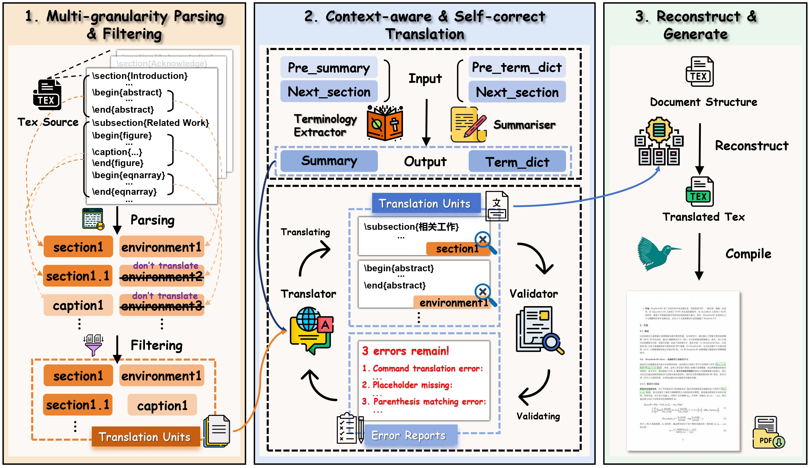
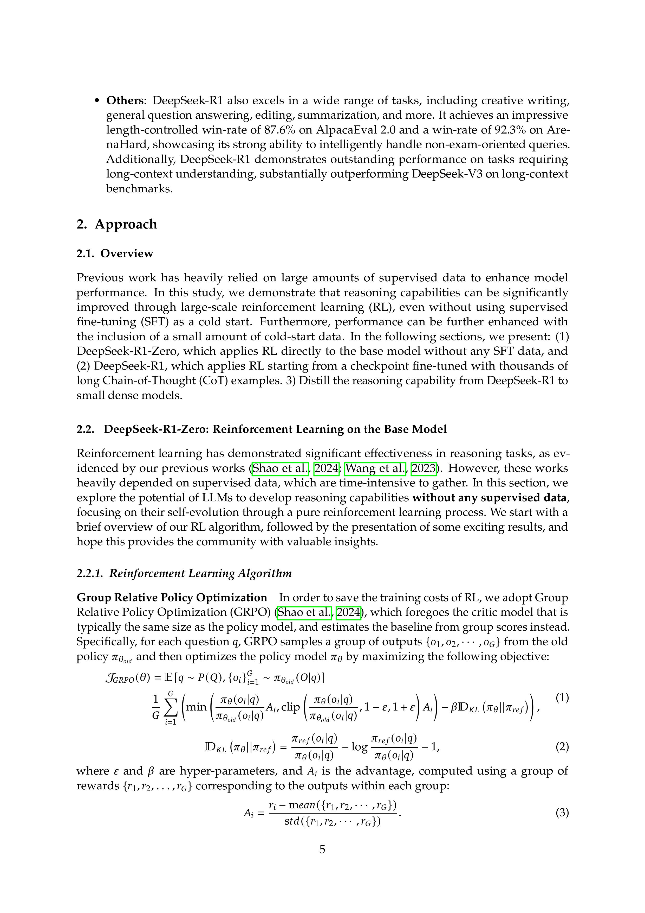
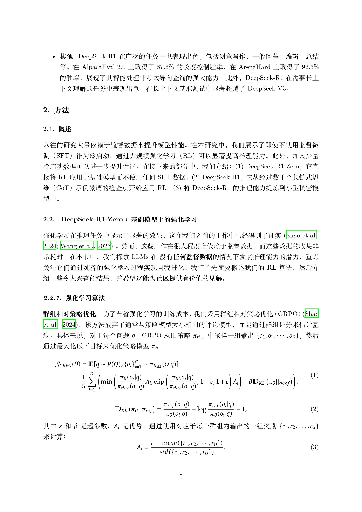
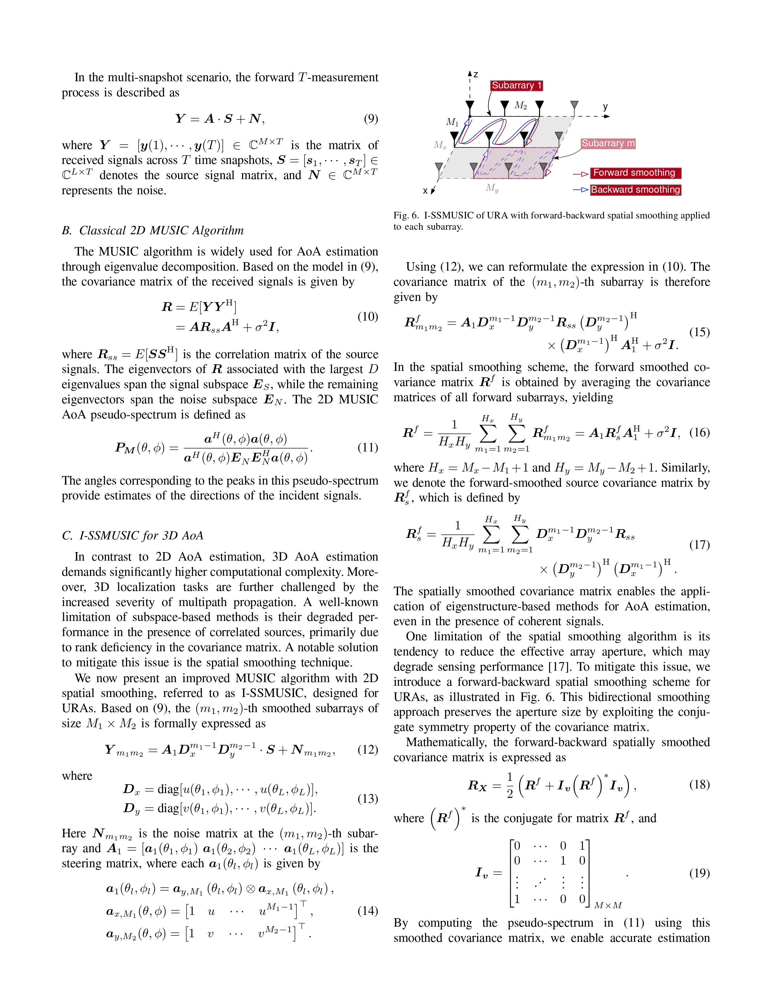
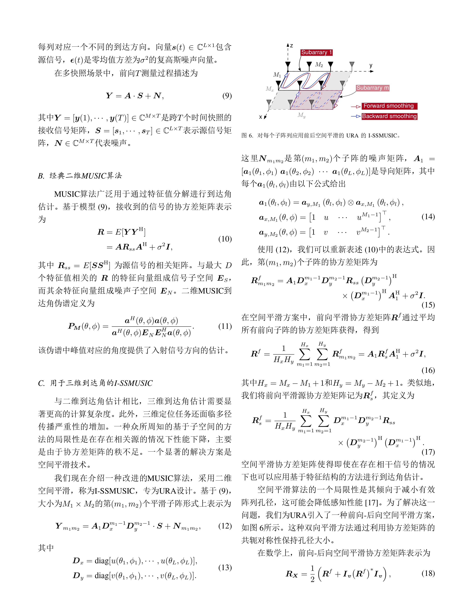

<div align="center">

[English](README.md) | 中文


</img>

  **Turn arXiv Papers into Multilingual Masterpieces**
#
<!-- <p align="center">
  <a href="https://arxiv.org/abs/2503.06594" alt="paper"></a>
</p> -->

</div>

<div align="center">
<p dir="auto">

• 📖 [介绍](#-介绍) 
• 🛠️ [安装指南](#️-安装指南) 
• ⚙️ [配置说明](#️-配置说明)
• 📚 [使用方式](#-使用方式)
• 🖼️ [翻译样例](#️-翻译样例) 

</p>
</div>

 从 arXiv 论文 ID 到译文 PDF 的端到端翻译。LaTeXTrans 有如下的特点和优势 :
 - **🌟 保持公式、排版和交叉引用的完整性**
 - **🌟 保证术语翻译的一致性**
 - **🌟 支持从原文 LaTeX 源码（通过提供的 arXiv 论文 id 自动下载）到译文 PDF 的端到端翻译**

借助 LaTeXTrans，研究人员和学生可以得到更高质量的论文翻译而无需担心格式混乱或内容缺失，从而更高效地阅读和理解 arXiv 论文。

# 📖 介绍

LaTeXTrans 是一个基于多智能体协作的结构化 LaTeX 文档翻译系统. 该系统能够直接翻译 LaTeX 代码，并生成与原文排版高度一致的译文 PDF。 不同于传统文档翻译方法（例如 PDF 翻译）容易破坏公式和格式，该系统使用大模型直接翻译预处理过的论文 LaTeX 源码，并通过由 Parser, Translator, Validator, Summarizer, Terminology Extractor, Generator 这六个智能体组成的工作流实现了排版一致和格式保持. 下图展示了 LaTeXTrans 的系统架构，请阅读我们已经发布的论文 🔗 [LaTeXTrans: Structured LaTeX Translation with Multi-Agent Coordination](https://arxiv.org/abs/2508.18791) 以获得更详细的系统介绍。

 

</img>

# 🛠️ 安装指南

#### 1. 克隆仓库

```bash
git clone https://github.com/PolarisZZM/LaTeXTrans.git
cd LaTeXTrans
pip install -r requirements.txt
```

#### 2. 安装MikTex（推荐, 更轻量）或TeXLive

如需编译LaTeX文件（例如生成PDF输出），需要安装 [MikTex](https://miktex.org/download) 或 [TeXLive](https://www.tug.org/texlive/) !

 > [!IMPORTANT]
*对于 MikTex，安装时请务必选择 “install on the fly”，此外，您需要额外安装 [Strawberry Perl](http://strawberryperl.com/) 支持编译。


# ⚙️ 配置说明


使用前请编辑配置文件：

```arduino
config/default.toml
```

设置语言模型的API密钥和基础URL：

```toml
model = " " # 模型名称（例如：deepseek-v3）
api_key = " " # your_api_key_here
base_url = " " # base url of the API
```

# 📚 使用方式

### 通过 ArXiv ID 翻译
只需提供 arXiv 论文 ID 即可完成翻译：

```bash
python main.py --arxiv ${xxxx}
# For example, 
# python main.py --arxiv 2508.18791
```

该命令将：

1. 从 arXiv 下载 LaTeX 源码并解压
2. 执行由解析、翻译、重构和编译组成的工作流
3. 在 outputs 文件夹保存翻译后的论文 LaTeX 项目文件和编译生成的译文PDF

 > [!NOTE]
尽管 LaTeXTrans 支持任意语言到任意语言的翻译，但是目前版本仅对英文到中文的翻译做了相对完善的编译适配。翻译到其他语言时，最终输出的 pdf 可能会有错误，欢迎提出 issue 来描述您遇到的问题，我们会逐个解决。

# 🖼️ 翻译样例

以下是 **LaTeXTrans** 生成的三个真实翻译样例，左侧为原文，右侧为译文。

### 📄 样例 1 ( 英文->中文 ) :

<table>
  <tr>
    <td align="center"><b>原文</b></td>
    <td align="center"><b>译文</b></td>
  </tr>
  <tr>
    <td></td>
    <td></td>
  </tr>
</table>

### 📄 样例 2 ( 英文->中文 ):

<table>
  <tr>
    <td align="center"><b>原文</b></td>
    <td align="center"><b>译文</b></td>
  </tr>
  <tr>
    <td></td>
    <td></td>
  </tr>
</table>

### 📄 样例 3 ( 英文->日文 ):

<table>
  <tr>
    <td align="center"><b>原文</b></td>
    <td align="center"><b>译文</b></td>
  </tr>
  <tr>
    <td></td>
    <td></td>
  </tr>
</table>

### 📄 样例 4 ( 英文->日文 ):

<table>
  <tr>
    <td align="center"><b>原文</b></td>
    <td align="center"><b>译文</b></td>
  </tr>
  <tr>
    <td></td>
    <td></td>
  </tr>
</table>

📂 **更多样例请查看[`examples/`](examples/) 文件夹**, 包含每个样例的完整翻译 PDF。

---

## Citation
```bash
@misc{zhu2025latextransstructuredlatextranslation,
      title={LaTeXTrans: Structured LaTeX Translation with Multi-Agent Coordination}, 
      author={Ziming Zhu and Chenglong Wang and Shunjie Xing and Yifu Huo and Fengning Tian and Quan Du and Di Yang and Chunliang Zhang and Tong Xiao and Jingbo Zhu},
      year={2025},
      eprint={2508.18791},
      archivePrefix={arXiv},
      primaryClass={cs.CL},
      url={https://arxiv.org/abs/2508.18791}, 
}
```